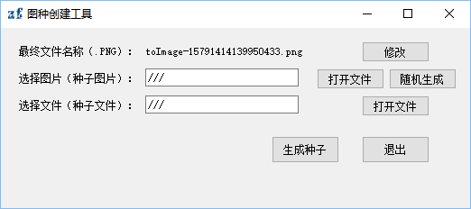
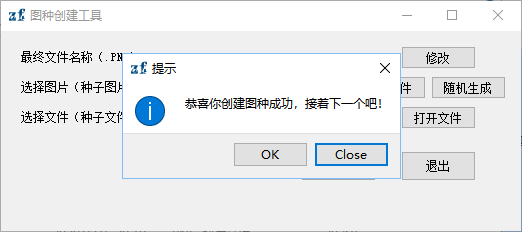
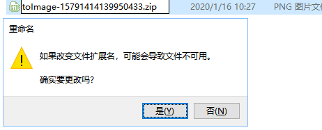

# 图种创建工具（Map Species）

图种编辑工具；可以将一些需要隐藏的文件使用图片隐藏，显示为图片，实际修改完后缀名后为被隐藏文件。

## 使用方法

> 使用提示：建议单个文件建立此种子，最好先压缩成压缩包，在建立种子文件，否则解种后文件可能乱码！

- 安装依赖包 `pip install PyQt5 Pillow --upgrade --user`

- 点击下载 [MapSpecies.exe](http://gitlab.zylliondata.local/zhangf/map-species/raw/master/dist/MapSpecies.exe)

- 双击文件运行

**程序主页面**

修改或不修改想要的最终文件名称，打开一个想要携带的图片载体（也可以随机生成一个<验证码>，只不过不太好看）；然后选择种子文件；点击 `生成种子` 按钮。

**运行效果如下**

**截图效果如下**

最后在你运行此`.exe`文件第目录下会产出一个种子文件（图片）；开心的进行存储和传递吧！！！😄，O(∩_∩)O。

## 解种

> 使用提示：建议单个文件建立此种子，最好先压缩成压缩包，在建立种子文件，否则解种后文件可能乱码！

解开种子之前你首先需要知道文件之前的后缀名是什么，否则解开失败。

**解种截图效果如下**

- 点击“是”皆可解开图种，双击打开就是你想要的文件了！！！

